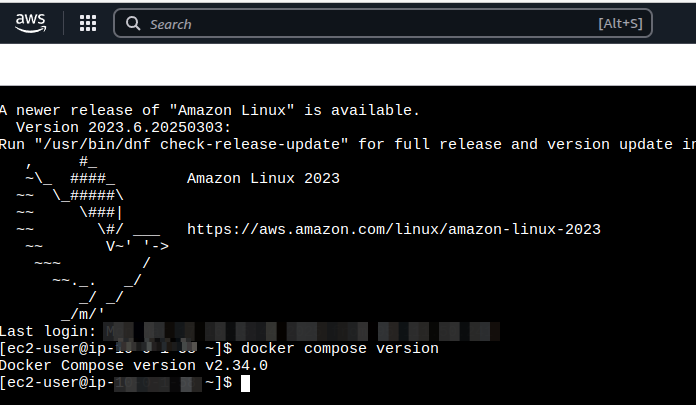

# Spot-EC2-Github-runner-Docker-compose-Cloudflare-DNS

## Disclaimer

This project is provided "AS IS" without any warranties or guarantees. 
The authors and contributors are not responsible for any charges incurred by using this project, including but not limited to AWS and Cloudflare charges. 
Additionally, the authors are not responsible for any security breaches or vulnerabilities that may arise from using this project. 
Users should not rely on this project for security practices and are encouraged to carefully examine the configuration and modify it if needed. 
Furthermore, be aware that the AWS and Cloudflare charging models might change in the future, and services that are currently free might become paid. 
Users are encouraged to review AWS, Cloudflare, and other services' pricing and set appropriate budgets and alerts to manage costs.
This project is not intended for production use and should be used for educational or testing purposes only.
Users should not forget to run "terraform destroy" when finished and to check that the command finished successfully. It is also recommended to perform a manual check to ensure that all AWS resources were destroyed.
Users are responsible for keeping their tokens secret and should not commit them to any git repository or otherwise share them. Note that Terraform variables are exposed in the tfstate files, even when the variables are marked "secret".
The authors are not responsible for any Cloudflare DNS attacks that might occur as a result of using this repository. Users should consider the Cloudflare charges that might incur, and the authors are not responsible for them.

## Overview

The project automates the setup of a GitHub runner on an AWS EC2 instance with Docker Compose and Cloudflare DNS. 
The project automates the following steps:
- Cloudflare ALB A record setup for a subdomain i.e. myproject.mydomain.com 
- AWS Spot instance request
- AWS VPC, security group and routing table setup.
- AWS IAM role and instance profile setup
- AWS CloudWatch setup
- Github runner registration
- Docker Compose setup
- Docker Compose configuration

Optionally the project supports traefik setup on the docker-compose for reverse proxying and load balancing, like deploying the docker-compose.traefik.yml from the "FastAPI Template" project.
Or any other custom docker-compose yml file might be used instead the docker-compose.traefik.yml, to setup anythng that is needed prior the github actions run. 

Please notice that this project is independent and only references the FastAPI Template for integration purposes.
There is no affiliation or endorsement from the FastAPI project authors to this project.

## Quick Start

1. **Copy the Variables Template**: Copy the `variables.auto.tfvars.template` into `variables.auto.tfvars`.
2. **Provide Values**: Fill in the necessary values for the variables in `variables.auto.tfvars`.
3. **Initialize Terraform**: Run `terraform init` to initialize the Terraform working directory.
4. **Apply Configuration**: Execute `terraform apply` to create the resources defined in the configuration.
5. **Cleanup**: After finishing with the GitHub runner, run `terraform destroy` to remove the resources.

**Important**: Monitor your AWS bill closely and never commit the `variables.auto.tfvars` or `tfstate*` files to git, as they will contain unencrypted passwords.

## Installation Guide

### Prerequisites

1. **Domain Registration**: Register a domain. Affordable domains can be obtained from providers like Namecheap.
2. **DNS Management**: Transfer your domain's DNS to Cloudflare. Detailed instructions can be found on the Cloudflare website. If your test domain is already managed by Cloudflare DNS, you can skip this step.

### Steps

1. **Template Configuration**: Copy the `variables.auto.tfvars.template` into `variables.auto.tfvars`.
2. **Domain Name Configuration**: Fill in the `domain_name` variable with your registered domain above.
3. **Cloudflare Token**: Create a Cloudflare API token with necessary permissions: All zones - Zone:Read, Page Rules:Edit, DNS:Edit. Use 'Client IP Address Filtering' for enhanced security.

4. **Token Setup**: Set the above token in the `cloudflare_api_token` variable.
5. **Cloudflare Zone ID**: Enter the `cloudflare_zone_id` variable. Use the Cloudflare UI to find it.

6. **AWS CLI Profile**: Establish an AWS CLI profile as guided [here](https://awscli.amazonaws.com/v2/documentation/api/latest/reference/configure/index.html).
7. **AWS Key Pair**: Generate an AWS key pair in your target `aws_region`, and download the `.pem` file.
8. **GitHub Runner Registration**: Navigate to your GitHub repository: Settings -> Actions -> Runners. Click "New self-hosted Runner" to generate a token.

9. **Token Configuration**: Input the GitHub token into the `github_token` variable. Ignore the other commands on that page as this project automates them.
10. **AMI ID**: Enter the `ami_id` variable with the appropriate value for your aws region. The project has been tested with the 'Amazon Linux 2023 AMI 2023.6.20250218.2 x86_64 HVM kernel-6.1', but most 'Amazon Linux 2023" AMIs should work. 
10. **Traefik Variables**: Configure Traefik variables by following [these instructions](https://github.com/tiangolo/full-stack-fastapi-postgresql/blob/master/deployment.md). If `traefik_docker_compose_path` is unset or empty, the Traefik integration will be disabled.
   When used, the `traefik_docker_compose_path` should point to the "docker-compose.traefik.yml" from a project based on the FastAPI template project (https://github.com/fastapi/full-stack-fastapi-template).
   With small changes, this variable could point to any docker-compose yml file that need to de deployed to the EC2 docker-compose instance before the github actions are triggered.
11. **Initialization**: Run `terraform init`.
12. **Deployment**: Run `terraform apply`.

### Verification

To verify a successful installation:

1. Confirm a new GitHub runner is registered and active.
   
2. Use AWS EC2 Connect to log into the instance and execute `docker version`.
   
3. Run `docker compose version` to confirm Docker Compose is installed.
   

### Troubleshooting

1. Log into the VM instance using EC2 Connect.
2. Review logs for errors using:
   - `sudo cat /var/log/cloud-init-output.log`
   - `sudo cat /start_github_runner_as_service.log`
   - `sudo cat /home/github/config_github_runner.log`
   - `sudo cat /home/ec2-user/traefik_docker_provisioner.log`

## Cost Management

To avoid unexpected charges, it is important to regularly review your AWS costs and set up billing alarms. Here are some steps to help you manage costs:

1. **Review AWS Pricing**: Familiarize yourself with AWS pricing for the services you plan to use. Visit the [AWS Pricing Calculator](https://calculator.aws.amazon.com/) to estimate costs.

2. **Set Up Billing Alarms**: Use AWS CloudWatch to set up billing alarms. This will notify you when your AWS charges exceed a certain threshold. Follow these steps:
   - Go to the AWS Management Console.
   - Navigate to CloudWatch.
   - Select "Billing" from the left-hand menu.
   - Click "Create Alarm" and set your desired threshold.

3. **Monitor Usage**: Regularly check your AWS usage and billing dashboard to stay informed about your spending.

## Contributions

Improvements and fixes are welcome! If you have suggestions or find any issues, feel free to open an issue or submit a pull request. We appreciate your contributions to make this project better.

## License

This project is licensed under the Apache License 2.0. See the LICENSE file for more details.
